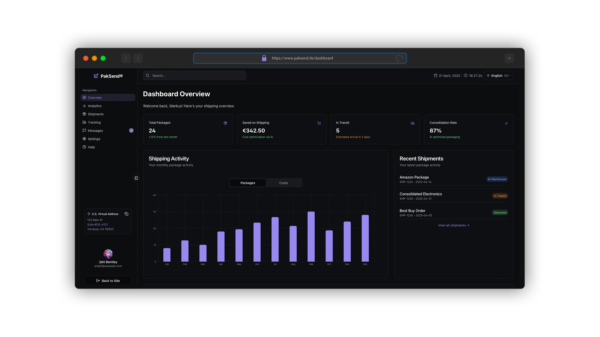

  
  <h1>PakSend: The Future of Global E-commerce Logistics</h1>
  
<strong>Unleashing a new paradigm in shipping with intelligent automation and unparalleled transparency.</strong>

  
  
  
  
  

---

## 🚀 Welcome to the Revolution

**PakSend** isn't just a shipping solution; it's the **next-generation SaaS platform** engineered to dismantle the barriers of cross-border e-commerce. We empower consumers in **Germany, the Dominican Republic, and Panama** to effortlessly access the vast U.S. retail market, transcending geographical limitations and conventional logistics headaches. By fusing **unyielding transparency, robust logistics management, and pioneering AI intelligence**, PakSend delivers a shipping experience that is not merely efficient, but truly transformative.

---

## 🌟 The PakSend Advantage: Beyond Shipping

We redefine what's possible in international package forwarding, offering more than just delivery – we offer a strategic advantage.

- ### **Global Access Unlocked**

    **Access exclusive U.S. retailers** previously out of reach. Secure your **dedicated U.S. virtual address** for just €10/month and unlock hassle-free purchasing from any American online store. Your personal gateway to the U.S. market is here.

- ### **Radical Transparency in Pricing**

    Experience **unprecedented clarity** in shipping costs. With PakSend, you pay only for the *actual* shipping expense, complemented by our transparent value-added service fees (setup, monthly subscription, and per-forwarding charges). These fees are meticulously designed to cover our premium support infrastructure and the advanced AI enhancements that differentiate our service. No hidden costs, no surprises.

- ### **Intelligent Automation, Elevated Service**

    Step into a world where logistics are **smart, seamless, and automated**. Our platform automates the entire lifecycle of package management, from reception and processing to intelligent forwarding. Leveraging sophisticated AI, PakSend proactively **predicts and executes optimal package consolidation strategies**, minimizing your costs and maximizing efficiency without manual intervention.

---

## 💡 Engineering Innovation: Features & Enhancements

PakSend is built on a foundation of cutting-edge technology and a relentless pursuit of operational excellence.

### **Core Functionality: Precision & Reliability**

- **Seamless User Onboarding & Ironclad Authentication:**
  - Rapid, intuitive registration culminating in the instant provision of your unique U.S. virtual address.
  - Leveraging **JWT-based authentication**, we ensure your data and transactions remain impervious to unauthorized access, safeguarding your privacy with every interaction.

- **Dynamic Virtual Address Management:**
  - Benefit from **real-time virtual address delivery** updates, keeping you informed from sender dispatch to warehouse arrival.
  - Our **transparent monthly subscription and one-time setup fee** encapsulate comprehensive, full-service logistics support, from package reception to final dispatch.

- **Effortless Package Handling & Forwarding:**
  - Intuitively **simulate package reception** and seamlessly initiate forwarding orders.
  - Access **crystal-clear itemized cost breakdowns**, powered by direct, real-time integration with leading international shipping carriers, ensuring accuracy and predictability.

### **AI-Driven Enhancements: The PakSend Intelligence Layer**

- **Intelligent Package Consolidation Engine:**
  - Our proprietary **AI module** employs advanced machine learning algorithms to meticulously analyze package arrival patterns, dimensions, and destinations. It then proactively **suggests and executes optimal consolidation strategies**, guaranteeing significant reductions in shipping costs (up to 80%) and minimizing processing delays.

- **Predictive Analytics Dashboard:**
  - Gain **smart insights** through real-time data visualization. Our predictive models analyze historical data and current market conditions to **forecast shipping trends**, provide highly accurate **estimated delivery times**, and continuously **monitor customer package behavior**. This empowers proactive logistical improvements and unparalleled foresight.

- **Automated Customer Support (AI Chatbot):**
  - Harnessing the power of **Conversational AI and Natural Language Processing (NLP)**, our intelligent chatbot serves as your 24/7 digital assistant. It guides users effortlessly through complex inquiries, including tracking updates, billing clarifications, and comprehensive troubleshooting, ensuring a remarkably seamless and responsive customer experience.

- **Personalized Recommendation Engine:**
  - Our **AI-powered offers** are tailored just for you. Based on your historical activity, package types, and unique preferences, our system intelligently suggests **additional services** such as express forwarding, comprehensive package insurance options, and exclusive consolidation discounts, maximizing your value from PakSend.

### **Developer & Operational Enhancements: Engineered for Excellence**

- **Modular, Highly Scalable Architecture:**
  - Built on a robust **Next.js backend and a dynamic React frontend**, our architecture is meticulously designed for unparalleled scalability and rapid iterative development, ensuring future-proof performance.
  - **Docker Compose** streamlines the entire development lifecycle, enabling effortless local development, rigorous testing, and highly reliable deployment across environments.

- **Transparent API & Agile Microservices:**
  - Interact with every facet of the PakSend service via **clean, well-documented RESTful endpoints**, facilitating seamless integration with third-party systems.
  - Leverage powerful **hooks** designed for direct integration with diverse payment processors and the seamless addition of bespoke AI modules, fostering boundless extensibility.

- **Comprehensive End-to-End Logging & Analytics:**
  - Benefit from **integrated monitoring systems** that provide real-time insights into application performance, proactive error handling, and granular statistics on user interactions, ensuring operational transparency and continuous improvement.

---

## 🛠️ Technology Stack

### Frontend

- **Framework**: React 18 with TypeScript
- **Styling**: Tailwind CSS
- **Component Library**: Shadcn UI
- **State Management**: React Query (Tanstack)
- **Data Visualization**: Recharts
- **Forms**: React Hook Form + Zod validation
- **Routing**: React Router DOM
- **Date Handling**: date-fns
- **Icons**: Lucide React
- **Notifications**: Sonner toast system

### Development

- **Build Tool**: Vite
- **Package Manager**: npm/bun
- **Linting**: ESLint with TypeScript support
- **Type Checking**: TypeScript 5.0
- **Version Control**: Git with conventional commits

## 📑 Documentation

Explore the depth of PakSend:

### User Documentation

- **Platform Guide**: Your comprehensive companion to mastering all PakSend features.
- **API Documentation**: For developers seeking to integrate their systems with our platform.
- **Customs Guidelines**: Essential regulatory information for smooth international shipping.
- **FAQ**: Instant answers to the most common inquiries about our service.

### Developer Documentation

- **Architecture Overview**: A deep dive into our system design and component structure.
- **API Reference**: Detailed endpoint documentation for all backend services.
- **Component Library**: A catalog of reusable UI components with practical examples.
- **Contributing Guide**: Guidelines for developers wishing to contribute to the PakSend ecosystem.

---

## 🔄 CI/CD Pipeline

Our commitment to quality through automation:

1. Automated testing rigorously performed on all pull requests.
2. Comprehensive type checking and linting for code integrity.
3. Automatic preview deployments for every feature branch.
4. Seamless automated deployment to staging and production environments.

## 🌐 Deployment

Deploy PakSend with confidence:

The application can be effortlessly deployed to various robust hosting platforms:

- **Vercel**: Recommended for simplicity and performance
- **Netlify**: Excellent alternative with similar features
- **AWS Amplify**: For enterprise deployments with AWS integration
- **Docker**: Container-based deployment for custom hosting

## 🤝 Support

- **Email**: [paksend.de@gmail.com](mailto:paksend.de@gmail.com)

## 📊 Analytics & Monitoring

- **Usage Analytics**: Track platform usage and feature adoption
- **Performance Monitoring**: Real-time application performance metrics
- **Error Tracking**: Automated error reporting and analysis
- **User Feedback**: Integrated feedback collection system

## 🔮 Roadmap

- **Q3 2025**: Predictive AI for Shipping Cost Reduction
- **Q4 2025**: Multi-Language, AI-Powered Customs Engine
- **Q1 2026**: Entry into New Markets with Local Logistics Integration
- **Q2 2026**: Dynamic Carrier Matching for E-Commerce Platforms
- **Q3 2026**: Global Trust System via Blockchain Package ID

👨‍💻 Developer

Meet the Mind Behind PakSend:

This platform is a testament to dedicated engineering and innovative design.

- [LinkedIn](https://linkedin.com/in/jahibentley)
- [GitHub](https://github.com/sjbentley)
- [Dribbble](https://dribbble.com/sirjahibentley)

## 📝 License

Copyright © 2025 PakSend. All rights reserved.

This software is confidential. Unauthorized copying, transfer, or use of this software is strictly prohibited.

---

[PakSend](https://linktr.ee/paksend.de) • [Tiktok](https://tiktok.com/@paksend.de) • [Instagram](https://instagram.com/paksend.de) • [Facebook](https://facebook.com/61575576613674)
